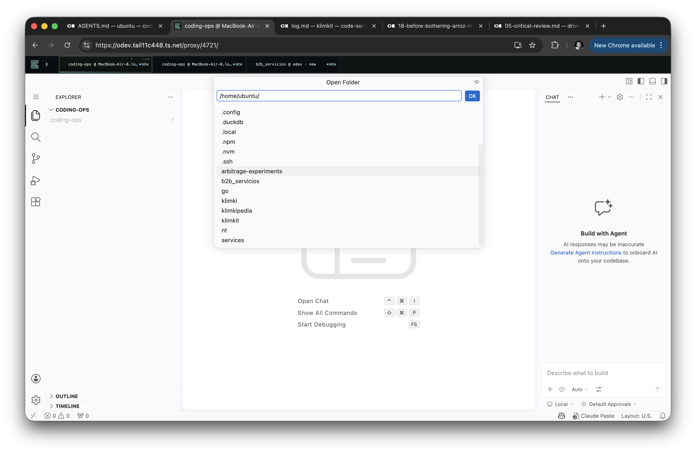

i installed on mac as client only, in UI selected mac (it appeared, good!) but code server in this iframe seemes to be looking at odev vm. Had to be code-server loooking at mac. could it be that you missed that codeserver has to be exposed from switchboard clients like https://mac.tail11c448.ts.net/?folder=/home/ubuntu/klimkit and this would be the iframe content???