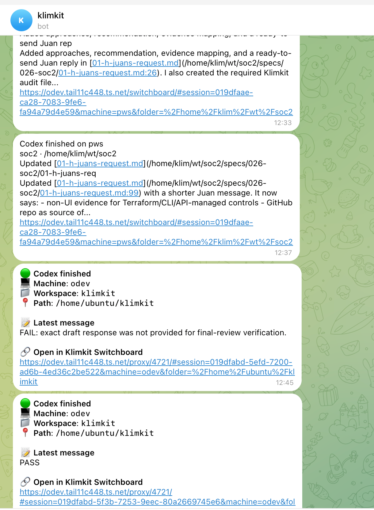

tmux new-session -A -s 'sessions id here' 'codex --dan... ->> use this instead for per tab copiable command! need tmux wrapper to make it more stable. if codex is already running in tmux, nothing should happens, correct behaviour

tabs should not have Close button on hover, archive instead. 

archiving doesn't work from dialog bc checkboxes aren't clickable

 still gettting some unformatted notification in tg.
also getting done notifications from subagents. need only from main agents!