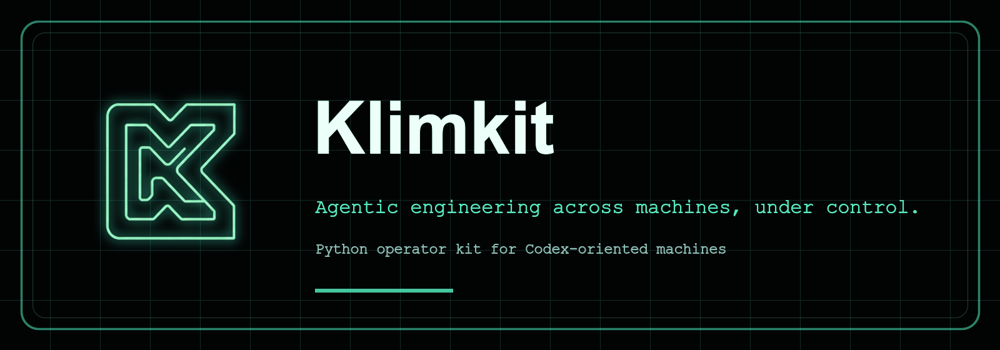

# Klimkit

[](LICENSE)
[](pyproject.toml)
[](tests/)
[](https://tailscale.com/)
[](packs/codex/)



Klimkit keeps an agent-ready machine reproducible. One repo owns the local instructions, harness packs, services, dashboards, and machine-specific settings needed to make a fresh VM behave like Klim's working environment. You edit the repo, preview exactly what will change, apply it locally, and use normal Git flow to carry the same operator setup to another machine.

## Table of Contents

- [Quick Install](#quick-install)
- [Tech Stack](#tech-stack)
- [Single Config](#single-config)
- [Generated Projections](#generated-projections)
- [Harness Pack](#harness-pack)
- [Security Model](#security-model)
- [Workflow](#workflow)
- [Common Commands](#common-commands)
- [Making Changes Live](#making-changes-live)
- [Contributing](#contributing)
- [Repository Layout](#repository-layout)
- [Development](#development)

## Quick Install

```bash
curl -fsSL https://raw.githubusercontent.com/klimentij/klimkit/main/install.sh | bash
```

Supported targets are macOS, Linux, and WSL2. Native Windows and Android/Termux are not supported targets yet.

Chrome is recommended for Switchboard because Klimkit dogfoods the UI against Chrome/code-server/Tailscale Serve paths.

After installation:

```bash
source ~/.zshrc    # or source ~/.bashrc
kk                 # show paths and setup commands
```

The installer clones or reuses `~/klimkit`, installs the `kk` launcher into `~/.local/bin`, and leaves config creation plus service changes to explicit `kk` commands.

## Tech Stack

- Python 3.11+ package with a stdlib `argparse` CLI
- `uv` for local execution, packaging, and dependency resolution
- TOML for the one local machine config
- SQLite for Switchboard server and agent state
- systemd user services and launchd LaunchAgents for the supervisor
- code-server for browser IDE access
- Tailscale Serve for private tailnet exposure
- Codex CLI projection for AGENTS guidance, config, hooks, subagents, and skills
- vanilla HTML/CSS/JS for Switchboard
- `unittest`, `coverage`, static pack validation, and optional live Codex startup smoke checks

`kk` reads the repo-local config, builds a previewable action plan, writes managed projections and services, and records ownership in a manifest so later applies can back up, prune, and uninstall only files Klimkit owns.

## Single Config

Klimkit uses one human-edited local config:

```text
~/klimkit/.klimkit/local/klimkit.toml
```

Runtime state lives beside it:

```text
~/klimkit/.klimkit/state/
~/klimkit/.klimkit/backups/
~/klimkit/.klimkit/logs/
```

Task artifacts and repo-work notes under `.klimkit/` are intentionally trackable in this repo. Machine-local config, runtime state, backups, and logs are ignored under `.klimkit/local/`, `.klimkit/state/`, `.klimkit/backups/`, and `.klimkit/logs/` because they can contain tokens or local DBs.

The default first VM enables both roles:

```toml
[components]
client = true
server = true
```

Client-only VMs report to the first VM:

```toml
[components]
client = true
server = false

[switchboard.agent]
enabled = true
backend_url = "https://<first-vm>.<tailnet>.ts.net/switchboard"
auth_token = ""
```

On a first VM that also runs `[switchboard.server]`, `switchboard.agent.enabled = true` is still the default. If `backend_url` is empty, Klimkit reports to the local Switchboard server.

Each client VM exposes its own local code-server through Tailscale Serve at `https://<client>.<tailnet>.ts.net/?folder=<absolute-path>`. Switchboard iframe tabs use the selected machine's code-server URL, not the central Switchboard server's code-server.

If Tailscale refuses Serve changes with `Access denied: serve config denied`, run `sudo tailscale set --operator=$USER` once on that machine, then run `kk apply` again.

Server settings live in the same file:

```toml
[switchboard.server]
enabled = true
host = "127.0.0.1"
port = 4721
base_path = "/switchboard"
auth_token = ""
```

Telegram notifications are optional and also configured in the same TOML:

```toml
[notifications.telegram]
enabled = false
bot_token = ""
chat_id = ""
```

## Generated Projections

Generated projections are files Klimkit writes because another tool expects a specific location. Edit `.klimkit/local/klimkit.toml` and repo pack files, not generated projections.

Current projections include:

```text
~/.codex/AGENTS.md
~/.codex/config.toml
~/.codex/hooks/
~/.codex/agents/
~/.codex/skills/
~/.config/code-server/config.yaml
~/.local/share/code-server/User/
~/.config/systemd/user/klimkit.service
~/Library/LaunchAgents/com.klim.klimkit.plist
```

Codex keeps its default home at `~/.codex`. Klimkit treats that directory as a managed projection target, while Klimkit's own editable config and runtime state live under `~/klimkit/.klimkit`.

## Harness Pack

The active Codex home-level harness is source-controlled in `packs/codex/` and projected into `~/.codex/` by `kk apply`, `kk pull`, and daemon autosync.

Current pack contents:

- `packs/codex/AGENTS.md` for shared home-level instructions.
- `packs/codex/config.toml` for GPT-5.5, xhigh reasoning, hooks, plugins, and trusted yolo defaults.
- `packs/codex/agents/` for shared subagents, including 3-pass final review workflows.
- `packs/codex/skills/` for reusable local skills, including `harness-tuning`.
- `packs/codex/hooks/` for Codex Stop notifications and Switchboard event hints.

To tune the shared harness, edit `~/klimkit/packs/codex/`, not `~/.codex/`. Then run:

```bash
uv run python -m unittest tests.test_codex_pack_validation -q
kk apply
git add packs/codex README.md
git commit -m "Tune Codex harness"
git push
```

Machines with autosync enabled pick up the commit from `origin/main`, apply the projection, restart managed services, and send Telegram summaries when configured.

## Security Model

Klimkit is designed for a trusted personal machine or private tailnet, not arbitrary public internet exposure.

**Important yolo-mode warning:** the default Codex pack is intended for a dedicated VM or external sandbox where `danger-full-access` and `approval_policy = "never"` are acceptable. Do not run this profile on a laptop or server that carries broad cloud credentials, sensitive private data, production write access, or unrelated personal files.

- Switchboard may run without a token only on loopback. Non-loopback server hosts require `switchboard.server.auth_token`.
- Tailscale Serve is the intended remote access boundary for Switchboard and code-server.
- code-server binds to loopback with `auth: none`; `kk apply` configures Tailscale Serve so each client exposes only its own loopback code-server to the private tailnet.
- The code-server template disables workspace trust and allows automatic tasks so the operator box behaves consistently for agent work. Treat this as a trusted-workstation setting.
- Switchboard agent helper binds to loopback by default. Change `switchboard.agent.helper_host` only for a trusted proxy path.
- Switchboard-launched Codex terminals use trusted-local automation defaults, including sandbox/approval bypass flags when configured.
- If code-server is missing, `kk apply` may plan an external network installer. Review `kk preview` before applying, or set `code_server.install_if_missing = false`.

The core risk is the AI-agent "lethal trifecta" described by [Simon Willison](https://simonwillison.net/2025/Jun/16/the-lethal-trifecta/): private-data access, exposure to untrusted content, and external communication. OWASP's [Top 10 for LLM Applications](https://owasp.org/www-project-top-10-for-large-language-model-applications/) also calls out prompt injection, sensitive information disclosure, insecure plugin/tool design, and excessive agency. For Klimkit, that means:

- Keep the VM's permissions minimal and purpose-built.
- Avoid mounting broad home directories or production secrets into the agent box.
- Prefer Tailscale/private network exposure over public listeners.
- Require human review before moving yolo-mode changes into production systems.

See `SECURITY.md` for the concise security notes.

## Workflow

On the VM where you are editing:

```bash
./install.sh
kk setup --skip-services
kk preview
kk apply
```

Use Git to move changes to another VM:

```bash
git status
git add <paths>
git commit -m "your change"
git push
```

Then run this on the other VM:

```bash
kk pull
```

`kk pull` fast-forwards the current branch from its upstream and then applies the local config. It refuses to pull over dirty local changes.

The daemon also autosyncs by default: every 5 seconds it fetches `origin/main`, fast-forwards the checkout when `main` is ahead, applies projections, and restarts the managed service.

## Common Commands

```bash
kk                 # show config path and next steps
kk setup           # create .klimkit/local/klimkit.toml and show the plan
kk setup --client-only
kk setup --server-only
kk preview         # render planned projections, installers, and services
kk apply           # apply the plan, restart managed services, and report live URLs
kk doctor          # diagnose config, repo, uv, and git
kk serve           # run Switchboard in the foreground
kk update          # fast-forward the current checkout
kk pull            # fast-forward current branch, then apply this VM
```

Skip service operations during tests or inspection:

```bash
kk setup --skip-services
kk apply --skip-services
```

Switchboard runs locally at:

```text
http://127.0.0.1:4721/switchboard/
```

When Tailscale Serve is configured, `kk apply`, `kk pull`, and `kk doctor` also print the tailnet proxy and serve URLs.

Expose it inside a tailnet with:

```bash
tailscale serve --bg --set-path / http://127.0.0.1:8080
tailscale serve --bg --set-path /switchboard http://127.0.0.1:4721/switchboard
tailscale serve status
```

If Tailscale asks for operator permissions, run `sudo tailscale set --operator=$USER` once and repeat `kk apply`.

## Making Changes Live

`kk apply` writes managed projections, reloads the service manager when services are enabled, restarts `klimkit.service`, and prints what changed plus the local URLs that are now live.

After editing this repo on the current VM:

```bash
kk apply
```

After pulling changes onto another VM:

```bash
kk pull
```

Use `--skip-services` only when you intentionally want to write files without touching the running service.

Autosync is enabled in new configs:

```toml
[workers]
auto_sync = true
auto_sync_interval_seconds = 5
auto_sync_ref = "origin/main"
```

Set `auto_sync = false` only on a VM where you want manual `kk pull` control.

When `[notifications.telegram]` is enabled, each successful autosync sends one short message with the hostname, role, commit range, changed file count, changed areas, and restart status.

## Contributing

Contributions should stay small, previewable, and test-backed. Start with `CONTRIBUTING.md`, use `.klimkit/tasks/` for non-trivial plans/proofs, and keep machine-local secrets under ignored `.klimkit/local/`, `.klimkit/state/`, `.klimkit/backups/`, and `.klimkit/logs/`.

Before opening or merging a meaningful change:

```bash
uv run python -m unittest discover -s tests -q
uv run coverage run -m unittest discover -s tests -q
uv run coverage report -m
```

## Repository Layout

```text
src/klimkit/                 Python package and runtime modules
packs/codex/                 Codex AGENTS/config/hooks/agents/skills pack
templates/code-server/       code-server config and user settings
templates/systemd/user/      Linux user service template
templates/launchd/           macOS LaunchAgent template
.klimkit/tasks/              trackable task plans, proofs, and implementation notes
.klimkit/memory.md           trackable repo preferences and corrections
.klimkit/log.md              trackable repo work log
tests/                       unittest suite
install.sh                   one-line installer entrypoint
```

## Development

```bash
uv run python -m unittest discover -s tests -q
uv run coverage run -m unittest discover -s tests -q
uv run coverage report -m
```

Optional live Codex smoke test:

```bash
KLIMKIT_RUN_CODEX_SMOKE=1 uv run python -m unittest tests.test_codex_smoke -q
```

The smoke test is skipped by default because it requires an installed and signed-in Codex CLI.
