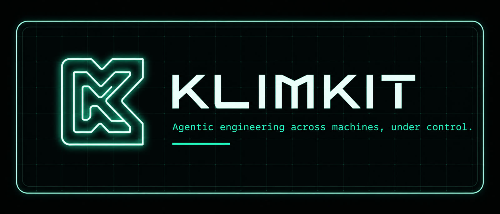
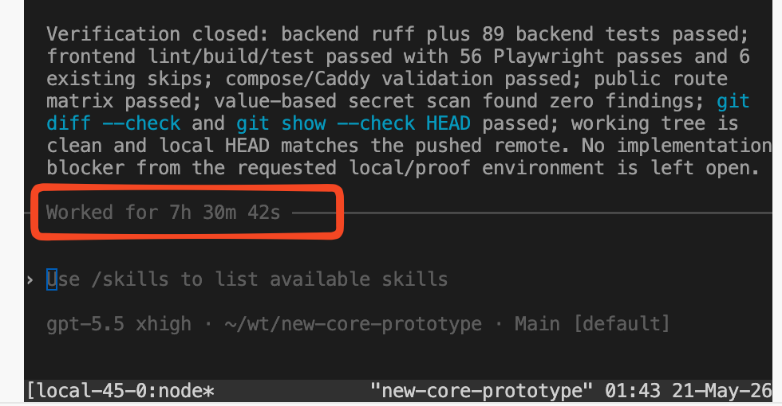
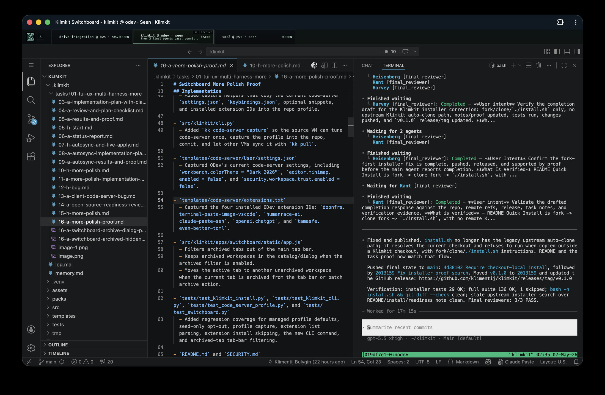
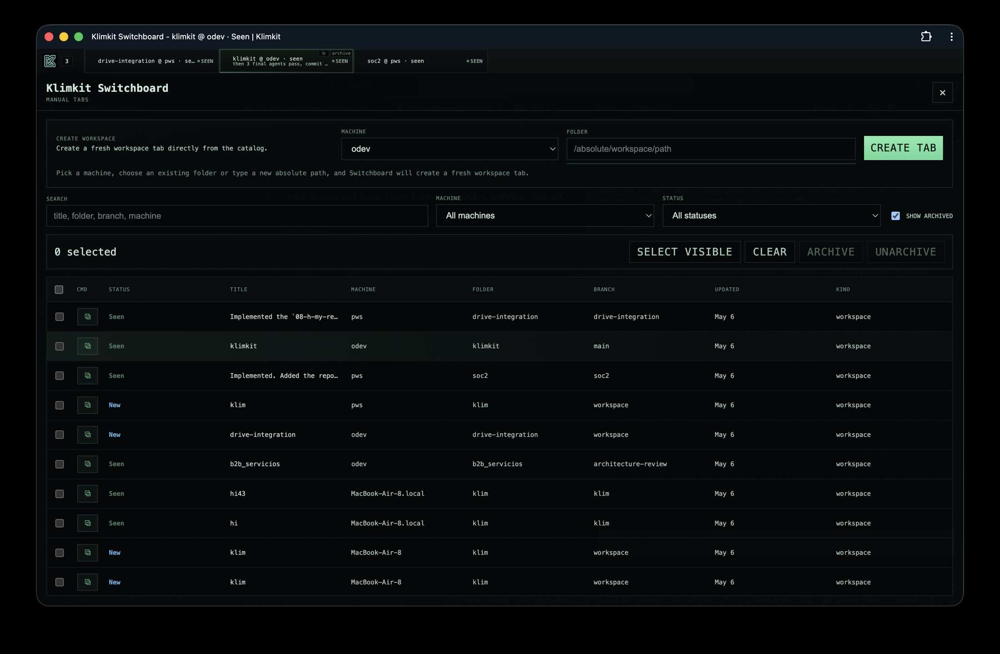
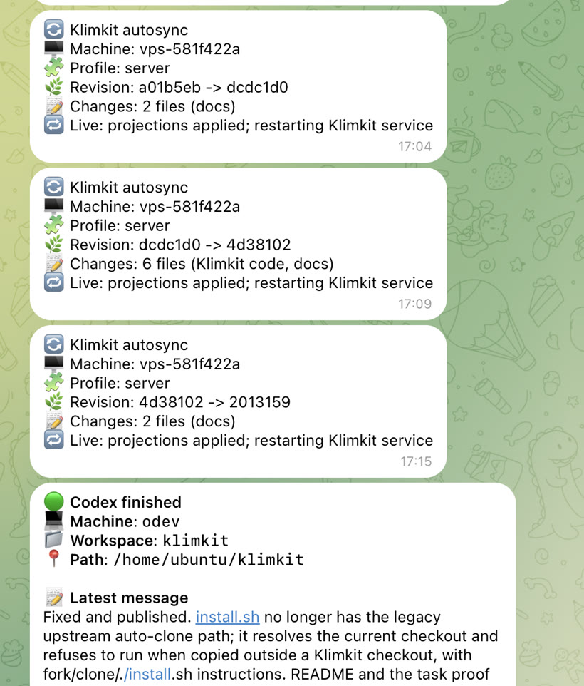

# Klimkit

[](LICENSE)
[](pyproject.toml)
[](tests/)
[](https://tailscale.com/)
[](packs/codex/)



Klimkit keeps an agent-ready machine reproducible. One repo owns the local instructions, harness packs, services, dashboards, and machine-specific settings needed to make a fresh VM behave like Klim's working environment. You edit the repo, preview exactly what will change, apply it locally, and use normal Git flow to carry the same operator setup to another machine.

Klimkit is most useful when an agent run is long enough that you cannot keep it all in your head. The proof has to live in the repo: task notes, checks, diffs, screenshots, reports, reflections, and final review.

### A 7.5 Hour Run Without Losing The Thread



One dogfood moment that captures the point: a vanilla Klimkit/Codex run worked for 7h 30m, stayed on goal without an outer loop such as `/goal`, and closed with backend tests, frontend checks, Playwright, secret scanning, Git checks, and a clean pushed state. The claim is not that every agent run should be seven hours. The claim is that long runs need inspectable artifacts after the model stops.

The core operating promise is parallel agent work without losing control: use Switchboard to keep 5-7 Codex/code-server workspaces open across machines, each on its own branch and worktree, while Klimkit keeps the harness, browser profile, services, and notifications synced.

### Switchboard PWA Workspace



### Workspace Catalog



## Table of Contents

- [Quick Install](#quick-install)
- [Release Status](#release-status)
- [Tech Stack](#tech-stack)
- [Single Config](#single-config)
- [Solo And Team Artifacts](#solo-and-team-artifacts)
- [Generated Projections](#generated-projections)
- [Code-Server Managed Profile](#code-server-managed-profile)
- [Harness Pack](#harness-pack)
- [Codex Harness Workflow](#codex-harness-workflow)
- [Reports](#reports)
- [Security Model](#security-model)
- [Workflow](#workflow)
- [Parallel Agent Worktrees](#parallel-agent-worktrees)
- [Common Commands](#common-commands)
- [Switchboard Browser Use](#switchboard-browser-use)
- [Making Changes Live](#making-changes-live)
- [Contributing](#contributing)
- [Repository Layout](#repository-layout)
- [Development](#development)

## Quick Install

Forking this repo first is recommended so your machines sync your operator profile, not the upstream default flavor. It is not required for trying Klimkit; the installer works from any local Klimkit checkout:

```bash
git clone https://github.com/<you>/klimkit.git ~/klimkit
cd ~/klimkit
./install.sh
```

Supported targets are macOS, Linux, and WSL2. Native Windows and Android/Termux are not supported targets yet.

Chrome is the preferred browser for Switchboard because Klimkit dogfoods the UI against Chrome/code-server/Tailscale Serve paths. For the best day-to-day experience, install Switchboard as a Chrome PWA from Chrome's install-app control in the address bar.

After installation:

```bash
source ~/.zshrc    # or source ~/.bashrc
kk                 # show paths and setup commands
```

The installer reuses the local checkout, installs the `kk` launcher into `~/.local/bin`, and leaves config creation plus service changes to explicit `kk` commands. It must be run from a local checkout; Klimkit does not support a remote one-line install or auto-cloning the upstream repo. Push profile changes to your fork, then run `kk pull` on each other machine.

## Release Status

Current release: [`v0.1.10`](https://github.com/klimentij/klimkit/releases/tag/v0.1.10).

`v0.1.10` keeps the public repo focused by removing internal marketing task artifacts from Klimkit after moving those notes to Klimkipedia. The public README, optimized images, and GitHub-facing project copy remain in place. The recommended path is still fork-first for real fleets: clone your fork, tune the repo-managed profile and harness pack, commit your changes, and let your machines sync from your fork. Direct upstream checkouts are fine for trying Klimkit. Treat upstream releases as review points for changes you may want to merge into your own operator repo.

## Tech Stack

- Python 3.11+ package with a stdlib `argparse` CLI
- `uv` for local execution, packaging, and dependency resolution
- TOML for the one local machine config
- SQLite for Switchboard server and agent state
- systemd user services and launchd LaunchAgents for the supervisor
- code-server for browser IDE access
- Tailscale Serve for private tailnet exposure
- Codex CLI projection for AGENTS guidance, config, hooks, subagents, and skills
- vanilla HTML/CSS/JS for Switchboard
- `unittest`, `coverage`, static pack validation, and optional live Codex startup smoke checks

`kk` reads the repo-local config, builds a previewable action plan, writes managed projections and services, and records ownership in a manifest so later applies can back up, prune, and uninstall only files Klimkit owns.

## Single Config

Klimkit uses one human-edited local config:

```text
~/klimkit/.klimkit/local/klimkit.toml
```

Runtime state lives beside it:

```text
~/klimkit/.klimkit/state/
~/klimkit/.klimkit/backups/
~/klimkit/.klimkit/logs/
```

Task artifacts and repo-work notes under `.klimkit/` are intentionally trackable in this repo. Machine-local config, runtime state, backups, and logs are ignored under `.klimkit/local/`, `.klimkit/state/`, `.klimkit/backups/`, and `.klimkit/logs/` because they can contain tokens or local DBs.

The default first VM enables both roles:

```toml
[operator]
human_name = "Human"
workflow = "solo"

[components]
client = true
server = true
```

`operator.human_name` is injected into projected harness instructions so the source pack can stay generic while each machine can address its human operator by the configured name. `operator.workflow` controls where agents write project evidence. `solo` keeps the existing flat `.klimkit/` layout, while `team` scopes writable evidence under `.klimkit/<human_name-as-folder>/`. A projected harness always works for one active human/operator; in team workflow that operator can still use the wider team's project knowledge as attributed context.

## Solo And Team Artifacts

Klimkit treats `.klimkit/` as a project evidence layer, not a private local cache. The machine-local parts stay ignored:

```text
.klimkit/local/
.klimkit/state/
.klimkit/backups/
.klimkit/logs/
```

The default `solo` workflow keeps agent-authored project artifacts in the flat layout:

```text
.klimkit/memory.md
.klimkit/log.md
.klimkit/reflection.md
.klimkit/tasks/
.klimkit/reports/
```

Team support is a light opt-in mode for shared repos where multiple humans use Klimkit on the same project. Solo remains the default and recommended path for a single builder. For a team, set:

```toml
[operator]
human_name = "Alice"
workflow = "team"
```

In team workflow, the projected harness tells agents to read the wider project evidence but write only inside the current operator folder:

```text
.klimkit/
  Alice/
    memory.md
    log.md
    reflection.md
    tasks/
    reports/
  Bob/
    memory.md
    log.md
    reflection.md
    tasks/
    reports/
```

The active operator can be a solo human or one human in a team. In team workflow, an AI harness still works for one current human at a time: it writes that human's task notes, memories, logs, reflections, and proof reports under the filesystem-safe folder derived from that human's name, while reading other operator folders as general team knowledge when relevant. When an agent uses another operator's memory, task note, log, or reflection, it should preserve attribution by keeping the source operator and file path visible in its reasoning, task proof, or new memory entry.

This keeps each operator's task notes, memories, logs, reflections, and proof reports Git-trackable without letting one agent silently rewrite another operator's evidence. The operator folder is derived from `human_name`, but reserved top-level names such as `memory.md`, `log.md`, `reflection.md`, `tasks`, `reports`, `local`, `state`, `backups`, and `logs` are rejected so migration cannot overlap solo artifacts or local runtime state. Switchboard reports include both `.klimkit/reports/**/*.html` and team-scoped `.klimkit/<operator>/reports/**/*.html`. Large report media remains ignored in both layouts.

To migrate an existing solo project after setting `human_name`, run the command from the project checkout:

```bash
cd /path/to/project
kk migrate team-workflow --dry-run
kk migrate team-workflow
```

When `kk migrate team-workflow` runs inside a checkout with `.klimkit/`, it migrates that project. For scripted migrations from another directory, or when no local Klimkit config exists, pass the project and human name explicitly:

```bash
kk migrate team-workflow --repo /path/to/project --human-name Alice --dry-run
kk migrate team-workflow --repo /path/to/project --human-name Alice
```

The migration moves only the trackable evidence folders/files (`memory.md`, `log.md`, `reflection.md`, `tasks/`, and `reports/`) into `.klimkit/<human_name-as-folder>/` and sets `workflow = "team"` only when it is migrating the configured Klimkit repo. It does not move `.klimkit/local/`, `.klimkit/state/`, `.klimkit/backups/`, `.klimkit/logs/`, secrets, runtime DBs, or generated service state. If a target already exists, the operator folder is reserved, or a planned target would overlap a source artifact, the migration stops before moving files. Run `kk apply` separately only after changing the active Klimkit harness config.

Client-only VMs report to the first VM:

```toml
[components]
client = true
server = false

[switchboard.agent]
enabled = true
backend_url = "https://<first-vm>.<tailnet>.ts.net/switchboard"
auth_token = ""
```

On a first VM that also runs `[switchboard.server]`, `switchboard.agent.enabled = true` is still the default. If `backend_url` is empty, Klimkit reports to the local Switchboard server.

Each client VM exposes its own local code-server through Tailscale Serve at `https://<client>.<tailnet>.ts.net/?folder=<absolute-path>`. Switchboard iframe tabs use the selected machine's code-server URL, not the central Switchboard server's code-server.

If Tailscale refuses Serve changes with `Access denied: serve config denied`, run `sudo tailscale set --operator=$USER` once on that machine, then run `kk apply` again.

Server settings live in the same file:

```toml
[switchboard.server]
enabled = true
host = "127.0.0.1"
port = 4721
base_path = "/switchboard"
auth_token = ""
```

Telegram notifications are optional and also configured in the same TOML:

```toml
[notifications.telegram]
enabled = false
bot_token = ""
chat_id = ""
```

## Generated Projections

Generated projections are files Klimkit writes because another tool expects a specific location. Edit `.klimkit/local/klimkit.toml` and repo pack files, not generated projections.

Current projections include:

```text
~/.codex/AGENTS.md
~/.codex/config.toml
~/.codex/hooks/
~/.codex/agents/
~/.codex/skills/
~/.config/code-server/config.yaml
~/.local/share/code-server/User/
~/.local/share/code-server/extensions/ from templates/code-server/extensions.txt
~/.config/systemd/user/klimkit.service
~/Library/LaunchAgents/com.klim.klimkit.plist
```

Codex keeps its default home at `~/.codex`. Klimkit treats that directory as a managed projection target, while Klimkit's own editable config and runtime state live under `~/klimkit/.klimkit`.
Klimkit manages `~/.config/code-server/config.yaml`. When `[code_server] managed_profile = true`, it also treats `templates/code-server/User/` and `templates/code-server/extensions.txt` as the authoritative browser IDE profile for every VM.

## Code-Server Managed Profile

Klimkit can sync one chosen code-server profile across machines. The default is:

```toml
[code_server]
enabled = true
managed_profile = true
install_if_missing = true
```

With `managed_profile = true`, every `kk apply`, `kk pull`, and autosync writes:

- `templates/code-server/User/settings.json` to `~/.local/share/code-server/User/settings.json`
- `templates/code-server/User/keybindings.json` to `~/.local/share/code-server/User/keybindings.json`
- `templates/code-server/User/snippets/` when snippets are captured
- `templates/code-server/extensions.txt` as extension IDs to install with code-server

To tune the shared profile, make the changes once in code-server on the source VM, then run:

```bash
kk code-server capture
git add templates/code-server README.md SECURITY.md src tests .klimkit
git commit -m "Sync code-server managed profile"
git push
```

Other machines pick it up with `kk pull` or daemon autosync. Set `managed_profile = false` only on a VM that should keep a local-only code-server profile; in that mode Klimkit seeds `User` defaults only when the files are missing.

## Harness Pack

The active Codex home-level harness is source-controlled in `packs/codex/` and projected into `~/.codex/` by `kk apply`, `kk pull`, and daemon autosync.

Codex pack files may contain projection tokens such as `__HUMAN_NAME__`, `__KLIMKIT_ARTIFACT_WORKFLOW__`, `__KLIMKIT_OPERATOR_FOLDER__`, and `__KLIMKIT_ARTIFACT_ROOT__`. Klimkit replaces them from the local `[operator]` config during projection.

Current pack contents:

- `packs/codex/AGENTS.md` for shared home-level instructions.
- `packs/codex/config.toml` for GPT-5.5, xhigh reasoning, hooks, plugins, and trusted yolo defaults.
- `packs/codex/agents/` for shared subagents, including 3-pass final review workflows.
- `packs/codex/skills/` for reusable local skills, including `harness-tuning`.
- `packs/codex/hooks/` for Codex Stop notifications and Switchboard event hints.

To tune the shared harness, edit `~/klimkit/packs/codex/`, not `~/.codex/`. Then run:

```bash
uv run python -m unittest tests.test_codex_pack_validation -q
kk apply
git add packs/codex README.md
git commit -m "Tune Codex harness"
git push
```

Machines with autosync enabled pick up the commit from `origin/main`, apply the projection, restart managed services, and send Telegram summaries when configured.

## Codex Harness Workflow

The shared Codex pack is intentionally opinionated about how agent work reaches completion. The projected `AGENTS.md` separates the workflow into intake, checklist, planning/delegation, implementation, verification, final review, and reporting.

For implementation tasks, the first blocking step is the `checklister` subagent. It writes an `Acceptance Checklist` into an agent-authored task note under the configured writable tasks directory: `.klimkit/tasks/<feature>/` in solo workflow or `.klimkit/<human_name-as-folder>/tasks/<feature>/` in team workflow. That checklist is meant to be concrete enough for a demanding human QA pass: exact UI screens and states when UI is involved, persistence and database expectations when state changes, local files and services when projections change, cross-machine sync behavior when relevant, and the named automated/manual checks that must pass.

Other subagents are used when they materially reduce risk:

- `code_explorer` traces unfamiliar code before edits.
- `test_writer` plans or writes focused tests.
- `manual_tester` checks real browser/UI flows.
- `security_auditor` reviews auth, secrets, sandboxing, infra, and sensitive boundaries.
- `code_reviewer` reviews meaningful or risky diffs.
- `debugger` isolates root causes when checks fail.
- `web_research` verifies current external APIs, docs, or best practices.

For UI work, task proof belongs under the configured writable reports directory: `.klimkit/reports/` in solo workflow or `.klimkit/<human_name-as-folder>/reports/` in team workflow. The HTML report should be Git-tracked, while large screenshots and native `agent-browser` video recordings stay as ignored local media referenced by relative paths. Put each screenshot and video in its own full-width section so the report is inspectable on a laptop screen. Prefer MP4 videos in the HTML report for reliable Chrome/PWA scrubbing; it is fine to convert the native `agent-browser` WebM recording to MP4 for presentation while keeping the source recording as evidence. The completion handoff should give the Tailscale-served report URL when this VM has a Tailscale DNS name; localhost report links are only local QA fallback evidence.

Before final review, non-trivial implementation work runs the Reflection Gate. The configured writable reflection file is an append-only timestamped cross-task Reflection Log: `.klimkit/reflection.md` in solo workflow or `.klimkit/<human_name-as-folder>/reflection.md` in team workflow. Entries are reflection sessions, not one required record per task. The default sections are `Observations`, `Derived Pattern`, `Insight`, and `Next Probe`; wider sessions may use up to ten named sections. Older reflection entries stay intact, and agents normalize them by appending a new-format entry when that older synthesis is relevant to the current work.

The final workflow step is always 3 parallel `final_reviewer` agents before a completion claim. Each reviewer gets the original request or task path, the checklist, changed files, verification evidence, the HTML proof report from the configured writable reports directory plus Tailscale report URL for UI work, and the exact final response draft. All 3 must pass before the response goes back to the human.

## Reports

Klimkit serves repo-local proof reports at `/reports/`. Reports stay inside each project checkout or worktree:

```text
<repo>/.klimkit/reports/<task>/report.html
<repo>/.klimkit/reports/<task>/assets/screenshot.png
<repo>/.klimkit/reports/<task>/assets/demo.mp4
<repo>/.klimkit/<operator>/reports/<task>/report.html
```

Configure roots in `.klimkit/local/klimkit.toml`; Klimkit does not scan the whole home directory:

```toml
[reports]
repo_roots = ["~/klimkit", "~/wt", "~/projects"]
```

`/reports/` renders one combined table from every configured root's `.klimkit/reports/**/*.html` and valid team-scoped `.klimkit/<operator>/reports/**/*.html`. It does not treat reserved flat artifact directories such as `.klimkit/tasks/reports` or symlinked report directories that escape the repo's `.klimkit` tree as valid report sources. Report HTML is meant to be tracked in Git; screenshots and videos under both reports layouts are ignored so commits stay small while VM-local proof remains viewable through the reports page.

When Tailscale Serve is available, the useful report handoff URL is `https://<machine>.<tailnet>.ts.net/reports/` or the specific report URL under that index. `kk apply`, `kk pull`, and `kk doctor` print this Tailscale reports URL so agent work can end with a shareable tailnet proof link instead of a localhost URL.

## Security Model

Klimkit is designed for a trusted personal machine or private tailnet, not arbitrary public internet exposure.

**Important yolo-mode warning:** the default Codex pack is intended for a dedicated VM or external sandbox where `danger-full-access` and `approval_policy = "never"` are acceptable. Do not run this profile on a laptop or server that carries broad cloud credentials, sensitive private data, production write access, or unrelated personal files.

- Switchboard may run without a token only on loopback. Non-loopback server hosts require `switchboard.server.auth_token`.
- Tailscale Serve is the intended remote access boundary for Switchboard and code-server.
- code-server binds to loopback with `auth: none`; `kk apply` configures Tailscale Serve so each client exposes only its own loopback code-server to the private tailnet.
- With `[code_server] managed_profile = true`, Klimkit syncs the repo's code-server profile and extension list to every VM. The managed profile disables workspace trust and allows automatic tasks so the operator box behaves consistently for agent work. Treat this as a trusted-workstation setting.
- Switchboard agent helper binds to loopback by default. Change `switchboard.agent.helper_host` only for a trusted proxy path.
- Switchboard-launched Codex terminals use trusted-local automation defaults, including sandbox/approval bypass flags when configured.
- If code-server is missing, `kk apply` may plan an external network installer. Review `kk preview` before applying, or set `code_server.install_if_missing = false`.

The core risk is the AI-agent "lethal trifecta" described by [Simon Willison](https://simonwillison.net/2025/Jun/16/the-lethal-trifecta/): private-data access, exposure to untrusted content, and external communication. OWASP's [Top 10 for LLM Applications](https://owasp.org/www-project-top-10-for-large-language-model-applications/) also calls out prompt injection, sensitive information disclosure, insecure plugin/tool design, and excessive agency. For Klimkit, that means:

- Keep the VM's permissions minimal and purpose-built.
- Avoid mounting broad home directories or production secrets into the agent box.
- Prefer Tailscale/private network exposure over public listeners.
- Require human review before moving yolo-mode changes into production systems.

See `SECURITY.md` for the concise security notes.

## Workflow

On the VM where you are editing:

```bash
./install.sh
kk setup --skip-services
kk preview
kk apply
```

Use Git to move changes to another VM:

```bash
git status
git add <paths>
git commit -m "your change"
git push
```

Then run this on the other VM:

```bash
kk pull
```

`kk pull` fast-forwards the current branch from its upstream and then applies the local config. It refuses to pull over dirty local changes.

The daemon also autosyncs by default: every 5 seconds it fetches `origin/main`, fast-forwards the checkout when `main` is ahead, applies projections, and restarts the managed service.

## Parallel Agent Worktrees

Before starting a feature, create a separate Git worktree and branch. The recommended pattern is:

- keep `main` as the staging or release-ready branch;
- keep `dev` as the integration branch that accumulates accepted feature branches;
- create one worktree per feature branch;
- open that worktree folder as a Switchboard tab;
- run parallel agents in separate worktrees so they do not fight over the same checkout.

The example helper at [`examples/create-worktree.sh`](examples/create-worktree.sh) creates a branch worktree from a synced integration branch. It defaults to `BASE_BRANCH=dev`, `SYNC_BRANCH=main`, and `WORKTREE_ROOT=$HOME/wt`.

```bash
examples/create-worktree.sh "switchboard archive polish"
```

For projects where `dev` should be fast-forwarded with `main` and pushed before creating the feature worktree:

```bash
PUSH_SYNCED_BASE=1 examples/create-worktree.sh "switchboard archive polish"
```

The script prints `switchboard_folder=<path>`. Use that folder in Switchboard's Create Workspace form so the new tab opens code-server directly on the feature worktree. Repeat this across machines to keep 5-7 agents working in parallel branches while Switchboard keeps their tabs and statuses visible.

## Common Commands

```bash
kk                 # show config path and next steps
kk setup           # create .klimkit/local/klimkit.toml and show the plan
kk setup --client-only
kk setup --server-only
kk preview         # render planned projections, installers, and services
kk apply           # apply the plan, restart managed services, and report live URLs
kk doctor          # diagnose config, repo, uv, and git
kk serve           # run Switchboard in the foreground
kk update          # fast-forward the current checkout
kk pull            # fast-forward current branch, then apply this VM
```

Skip service operations during tests or inspection:

```bash
kk setup --skip-services
kk apply --skip-services
```

Switchboard runs locally at:

```text
http://127.0.0.1:4721/switchboard/
```

When Tailscale Serve is configured, `kk apply`, `kk pull`, and `kk doctor` also print the tailnet proxy and serve URLs.

Expose it inside a tailnet with:

```bash
tailscale serve --bg --set-path / http://127.0.0.1:8080
tailscale serve --bg --set-path /switchboard http://127.0.0.1:4721/switchboard
tailscale serve --bg --set-path /reports http://127.0.0.1:4721/reports
tailscale serve status
```

If Tailscale asks for operator permissions, run `sudo tailscale set --operator=$USER` once and repeat `kk apply`.

## Switchboard Browser Use

Chrome is the preferred Switchboard browser. Installing the Switchboard URL as a Chrome PWA gives the cleanest app window and avoids mixing agent tabs into a normal browsing session.

Switchboard keeps the active and most recently used code-server tabs loaded in memory so PWA tab switching does not constantly reload iframes. Configure that with `[switchboard.server] max_loaded_tabs`; the default is `5`. Each loaded code-server tab uses roughly 400 MB RAM, so lower it on small clients or raise it on larger machines.

Switchboard keyboard shortcuts use `Control` + `Option` on macOS, or `Control` + `Alt` on Linux/Windows:

- `Control` + `Option` + `0`: open the workspace catalog dialog.
- `Control` + `Option` + `1` through `9`: switch to that visible tab number.
- `Control` + `Option` + `Left` / `Right`: move to the previous or next visible tab.
- `Control` + `Option` + `F`: open the workspace catalog.
- `Control` + `Option` + `N`: open the create-workspace dialog.
- `Escape`: close the open dialog.

## Making Changes Live

`kk apply` writes managed projections, reloads the service manager when services are enabled, restarts `klimkit.service`, and prints what changed plus the local URLs that are now live.

After editing this repo on the current VM:

```bash
kk apply
```

After pulling changes onto another VM:

```bash
kk pull
```

Use `--skip-services` only when you intentionally want to write files without touching the running service.

Autosync is enabled in new configs:

```toml
[workers]
auto_sync = true
auto_sync_interval_seconds = 5
auto_sync_ref = "origin/main"
```

Set `auto_sync = false` only on a VM where you want manual `kk pull` control.

When `[notifications.telegram]` is enabled, each successful autosync sends one short message with the hostname, role, commit range, changed file count, changed areas, and restart status.



## Contributing

Contributions should stay small, previewable, and test-backed. Start with `CONTRIBUTING.md`, use `.klimkit/tasks/` for non-trivial plans/proofs, and keep machine-local secrets under ignored `.klimkit/local/`, `.klimkit/state/`, `.klimkit/backups/`, and `.klimkit/logs/`.

Before opening or merging a meaningful change:

```bash
uv run python -m unittest discover -s tests -q
uv run coverage run -m unittest discover -s tests -q
uv run coverage report -m
```

## Repository Layout

```text
src/klimkit/                 Python package and runtime modules
packs/codex/                 Codex AGENTS/config/hooks/agents/skills pack
templates/code-server/       code-server config and user settings
templates/systemd/user/      Linux user service template
templates/launchd/           macOS LaunchAgent template
.klimkit/tasks/              trackable task plans, proofs, and implementation notes
.klimkit/memory.md           trackable repo preferences and corrections
.klimkit/log.md              trackable repo work log
tests/                       unittest suite
install.sh                   one-line installer entrypoint
```

## Development

```bash
uv run python -m unittest discover -s tests -q
uv run coverage run -m unittest discover -s tests -q
uv run coverage report -m
```

Optional live Codex smoke test:

```bash
KLIMKIT_RUN_CODEX_SMOKE=1 uv run python -m unittest tests.test_codex_smoke -q
```

The smoke test is skipped by default because it requires an installed and signed-in Codex CLI.
